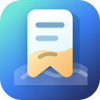

# 签屿 · Mark Isle

简体中文 | [English](README.en.md)



**签屿（Mark Isle）** 是一个 **local-first** 的 Chrome 书签导航与新标签页管理扩展：覆盖新标签页，做成可自定义的导航看板，数据本地优先、多端靠云盘目录同步、可选接入 LLM 自动分类。

## 项目简介

签屿是一个面向个人知识入口和日常效率场景的 Chrome 书签管理工具。它把浏览器新标签页变成可拖拽、可分区、可多页管理的导航看板，让常用网站、工作链接、学习资料和临时收藏都能沉淀在一个本地优先的空间里。

项目重点解决三个问题：书签难整理、多设备同步不透明、第三方服务依赖过重。签屿使用 IndexedDB 保存本地数据，通过 File System Access API 把设备快照写入用户自己选择的云盘文件夹，再由 iCloud Drive、坚果云、Dropbox、OneDrive 等云盘客户端同步；没有中心化后端，离线也能正常使用。对于大量存量书签或日常新增链接，签屿还支持接入 OpenAI 兼容接口进行 AI 自动分类，并在未配置 AI 时回退到本地规则分类。

## 关键词

Chrome 书签插件、书签管理、新标签页、导航页、网址导航、个人导航、书签同步、云盘同步、本地优先、离线优先、AI 自动分类、浏览器扩展、效率工具、个人知识管理。

## 适合谁

- 想把 Chrome 新标签页变成个人导航看板的用户。
- 想用 iCloud Drive、坚果云、Dropbox、OneDrive 等云盘同步书签，但不想依赖中心化服务器的用户。
- 想让新增书签自动分类，同时保留离线可用和本地数据控制权的用户。

## 核心特性

- **离线优先**：所有数据存在浏览器本地 IndexedDB，是唯一事实来源。断网、弱网、云盘故障都不影响使用与查找。
- **导航看板**：多个导航页（标签） -> 每页多个区域（自定义标题/Logo/颜色） -> 每个区域内书签卡片（图标/标题/备注），支持拖拽排序与跨区域移动。
- **云盘目录同步（无中心化服务）**：用 File System Access API 授权一个云盘本地同步文件夹（iCloud Drive / 坚果云 / Dropbox / OneDrive 等任意），扩展把数据写成 JSON，由云盘客户端负责跨设备搬运。每台设备只写自己的 `device-<id>.json`，读取时本地合并，避免云盘冲突副本导致数据丢失。
- **快速收藏**：工具栏弹窗、右键菜单、快捷键（默认 `Command+Shift+S` / `Ctrl+Shift+S`）一键收藏当前页。
- **AI 自动分类**：设置页填任意 OpenAI 兼容接口（自带 Key），新增书签时自动给出分类；未配置/失败/离线时降级为本地域名+关键词规则，始终可用。
- **备份与恢复**：一键导出/导入 JSON，导入按版本+时间智能合并。

## 技术栈

React 18 + Vite + TypeScript + Tailwind，Dexie(IndexedDB)，dnd-kit，Zustand，Manifest V3（CRXJS）。

## 开发

```bash
npm install
npm run dev      # 开发模式（HMR）
npm run build    # 产出 dist/
npm run test     # 跑合并逻辑单测
```

## 加载到 Chrome

1. `npm run build` 生成 `dist/`
2. Chrome 打开 `chrome://extensions`，开启「开发者模式」
3. 「加载已解压的扩展程序」选择 `dist/` 目录
4. 打开新标签页即为导航看板

## 配置云盘同步

1. 在设置页点「选择云盘文件夹」
2. 选一个位于云盘本地同步区内的文件夹，例如：
   - iCloud：`~/Library/Mobile Documents/com~apple~CloudDocs/Mark Isle`
   - 坚果云：坚果云同步文件夹下任意子目录
   - Dropbox / OneDrive：对应同步文件夹下任意子目录
3. 其它设备装上扩展后，指向**同一个云盘文件夹**即可自动合并
4. 数据写在该文件夹的 `mark-isle/` 子目录里

> 注意：受浏览器扩展沙箱限制，目录同步在你打开新标签页/设置页时触发，无法纯后台静默运行。这是所有同类扩展共同的硬约束。

## 数据与隐私

- 书签数据只存本地 IndexedDB + 你指定的云盘文件夹，无任何第三方服务器。
- LLM API Key 经 Web Crypto 加密后存本地，仅在调用你填写的接口时使用。

## 目录结构

```text
mark-isle/
├─ manifest.config.ts     # MV3 manifest
├─ src/
│  ├─ newtab/             # 新标签页导航看板（主界面）
│  ├─ popup/              # 工具栏快速收藏
│  ├─ options/            # 设置页：云盘授权 / LLM / 导入导出
│  ├─ background/         # service worker：右键菜单 / 快捷键收藏
│  ├─ data/               # db / repository / fileSync / merge / backup
│  ├─ ai/                 # classifier(LLM) / ruleFallback(本地规则)
│  ├─ store/              # Zustand
│  └─ shared/             # types / id / favicon / crypto
└─ test/                  # merge 合并逻辑单测
```
